# Results of Testing

The test results show the actual outcome of the testing, following the [Test Plan](test-plan.md)

---

## Testing Coin Placement

I need to make sure that coins are placed on the grid correctly

### Test Data To Use

I will run the game multiple times to see how the coins get placed

### Expected Test Result

I should see always see five coins called Coin 1, Coin 2, Coin 3, Coin 4 and, Gold, each coin should be in a random grid and not in the same grid as another coin

---

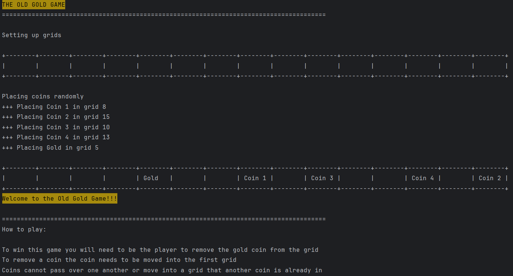

In my first test each coin was placed into a grid like I expected, I then ran the code again to check whether their placement was random or not.
As seen in the second image, the coins were placed into different grids as the previous test.
I then ran the code again to make sure that their placement was definitely random, and each time most of the coins were in different grids from the previous and not in the same grids as another coin.
The coins were always within the 15 grids so, they had not gone out of the boundary.

---

## Testing Grid Display

I need to make sure that the coins and grids are displayed so that the user can see the game board and the changes that are made throughout the game.

### Test Data To Use

I will run the game multiple times to see whether the grid keeps it expected shape when coins are placed into different grids

### Expected Test Result

The grids will have every coin fitting nicely inside, and the corners of each grid will have the + line up with the sides |, I expect the coins to fit within the sides |   |

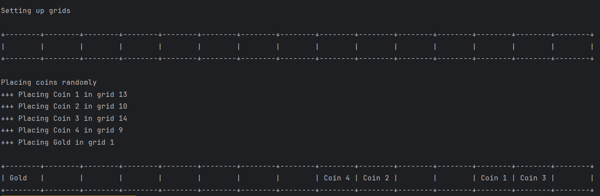

When I was to run the code, the grid appeared in the +--------+ | | way that I had expected that it would line up, and when the coins were placed inside, the grids were not moved in any way and the coins fitted nicely inside.

---

## Moving the coin one space

I need to see whether the coins are able to move into another grid and not move into grids that other coins are already in.
If the coin is in the first grid, it will be removed from the grid.

### Test Data To Use

I will test moving multiple coins around and see what happens when they are to move into another coin and move when on the first grid.

### Expected Test Result

I expect the coin to disappear from the grid it is currently in and move into the grid to its left. If the coin is in the first grid I expect it to be removed from the game.

---

In my first test when I tried to move the coin instead of moving one space to the left, another one of the same coin was made, it continued to duplicate itself and removed other coins in its way
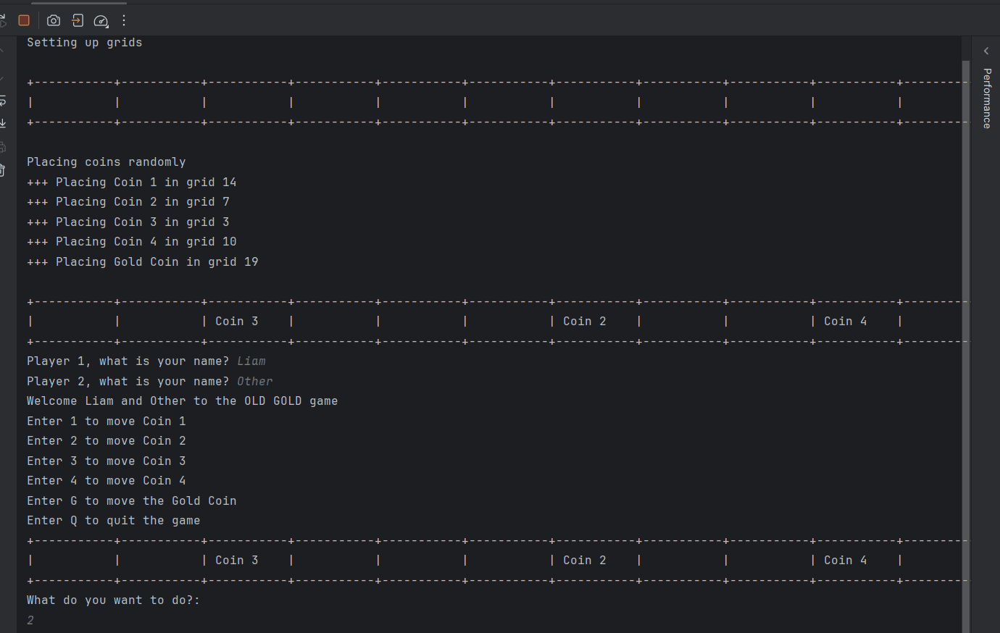

In my next test I then added some code to make the grid the coin was originally in empty before moving the coin
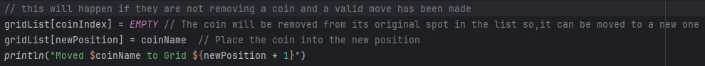

---

This solved the issue of the coin duplicating itself however, I still hadn't solved the issue of the coin moving into grids other coins are in
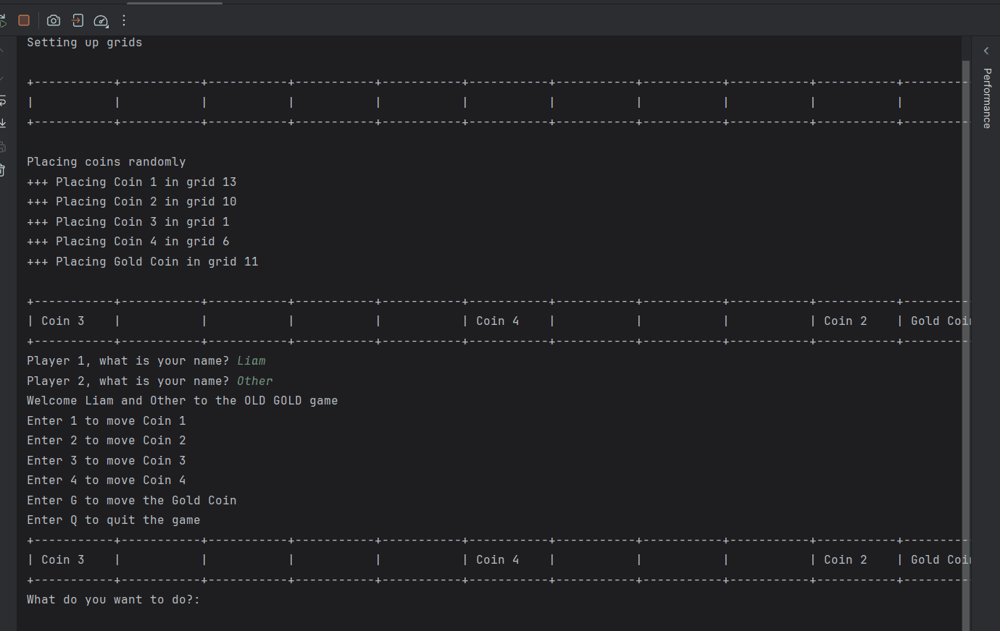
---

I solved this issue by adding in another if branch so that when there is another coin in the grid to the left of the coin being moved an error message will appear and the user will be asked to try again.
I tested moving multiple different coins into each other, and everytime the error message was played as seen in the below GIF.

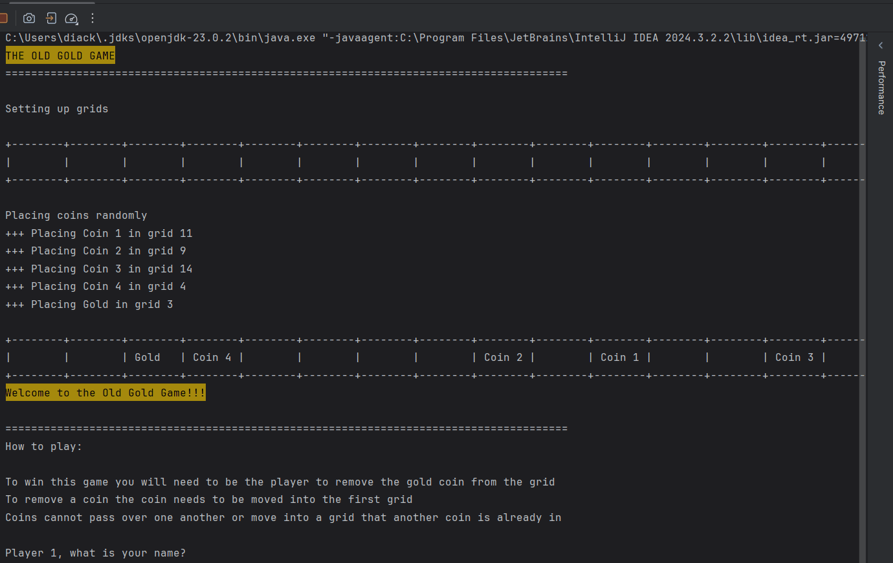

---

When I was to remove a coin from the first grid this error occurred because I was bringing the coin out of the boundary
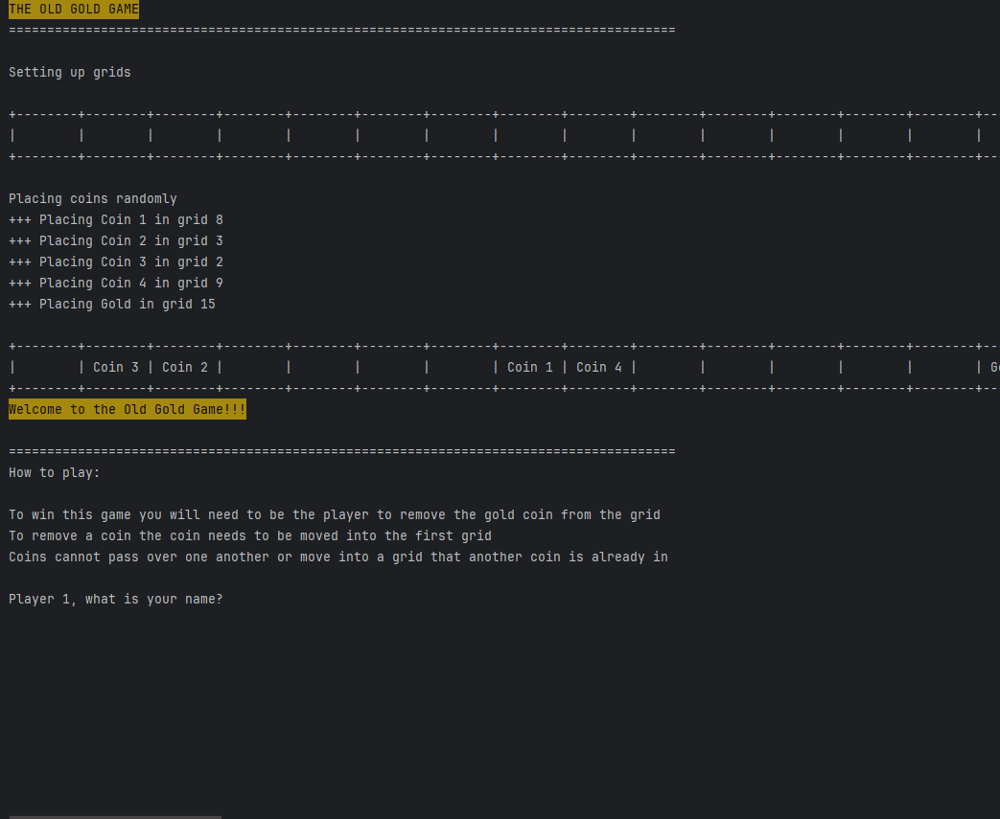
---

I solved this issue by editing my code so that when I was to remove a coin, its grid would become EMPTY
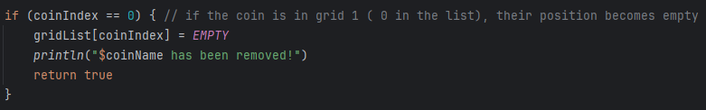
---

However, in my next test when I was to try and move the removed coin (invalid data the user could enter), a new error occurred due to that coin being no longer in the grid
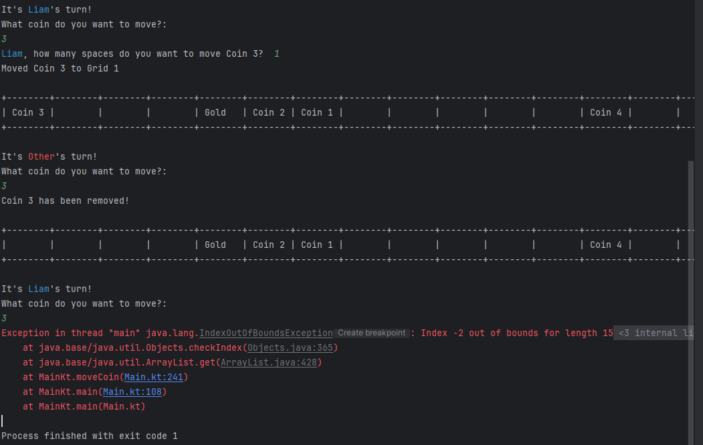
---

I solved this issue by making it so that when the player is to try and move the removed coin, they would be told the coin is no longer in the grid. 
This was done by making every removed coin have a coinIndex of -1 so that when you are to choose to move a removed coin, the if branch for coinIndex = -1 will force the player to try again

---

## Choosing how many spaces to move the coin

I need to make sure that the user will be able to choose how many spaces they move the coin without passing another coin while not going out of the grids.
The coins will only be able to move to the first grid where if they are then moved will be removed from the game.

### Test Data To Use

I will test moving coins more than 20 grids (the number of grids),
move a coin within the number of grids while going past grid 1,
I will test moving a coin into grid 1, the boundary
move multiple coins around testing that they won't be able to pass over another,
and move a coin a decimal and a negative amount of grids.
I will also test that the coin is removed and the user will not be asked how many spaces to move the coin, if it is in the first grid.

### Expected Test Result

I expect that when the user is asked how many spaces they can move the coin, if the user is to enter a number that will cause the coin to move off the grid they will be given the message "You cannot move past grid 1" and the coin will not move.
I expect that when the user is to make the coins pass over another, they will be given the message "Cannot move another coin is in the way at grid X" and the coin will not move.
I expect that when the user is to enter a decimal or a negative number, they will be asked to enter a valid number.
I expect that the user will not be asked how many spaces to move the coin, and it will instead be removed if the chosen coin is in the first grid.

---

In my first test I attempted valid moves from the player, moving the coin out of the boundary and, invalid moves of coins passing over one another or into a grid another coin was in.

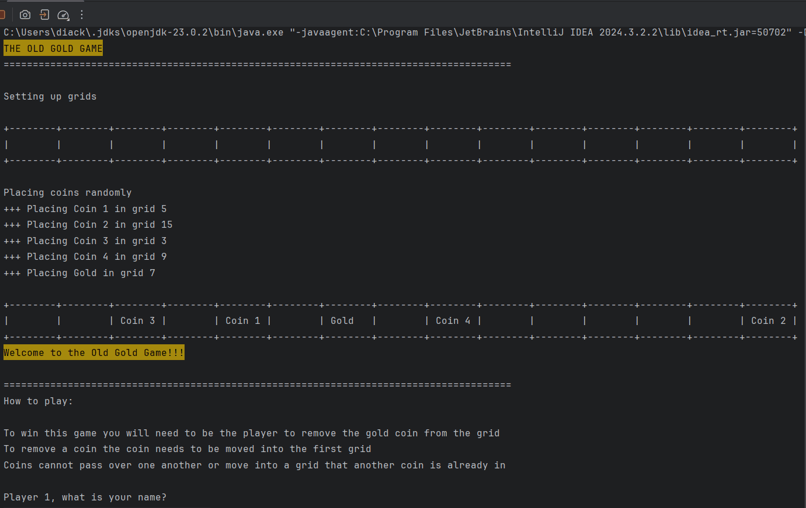

As I had expected, the valid moves allowed the coins to move multiple spaces to the left, when the user was to move a coin out of the boundary the correct error message was played.
However, I had not expected for the coins to be able to pass over one another or into a grid another coin because when the coin is to move one space the error message had played and I had not considered multiple spaces making a difference.

---

This error was solved by making it so that if any grids are not empty from the coin's original position to its new position, there will be an error message played and they will be asked to go again.
I also tested whether the user could enter decimals, a negative number, or a string for the number of spaces they want to move the coin.

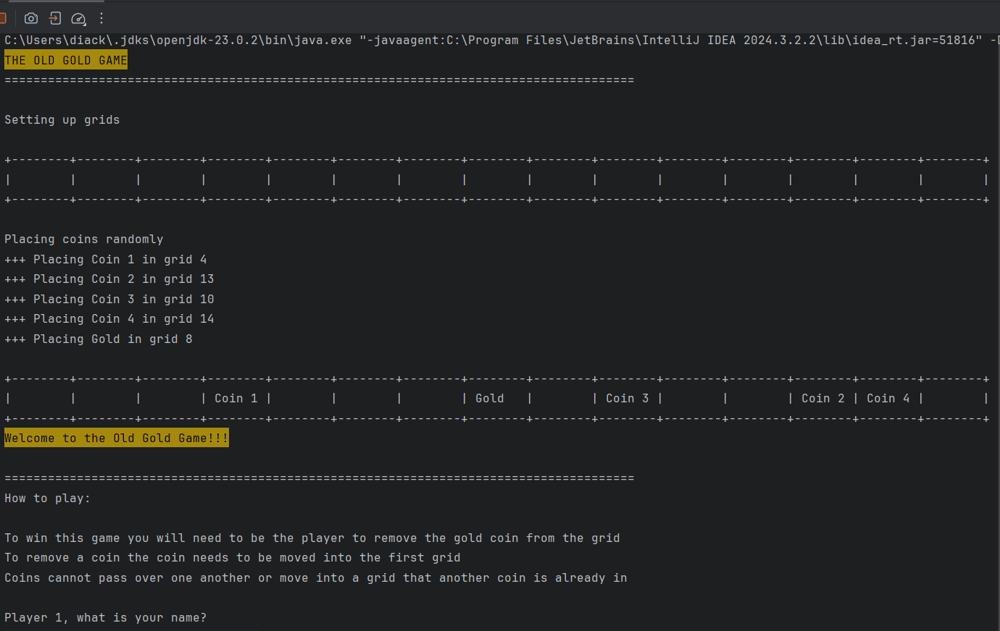

---

As I had expected the error of coins moving over one another or moving into another coin's grid was fixed, I had not expected the user to be able to enter negative numbers or the game to stop from decimals and words.
I had expected the users to be asked to enter the number of spaces to move again if they were to enter an invalid number.
This issue was later solved by changing the number of spaces to an IntOrNull instead of just an integer so that when the user enters a null, they will be asked to enter again. This did not solve the negative number of spaces to move so I had to enter an if branch so that if the spaces to move is less than 1 the user will be asked to enter a number more than zero.

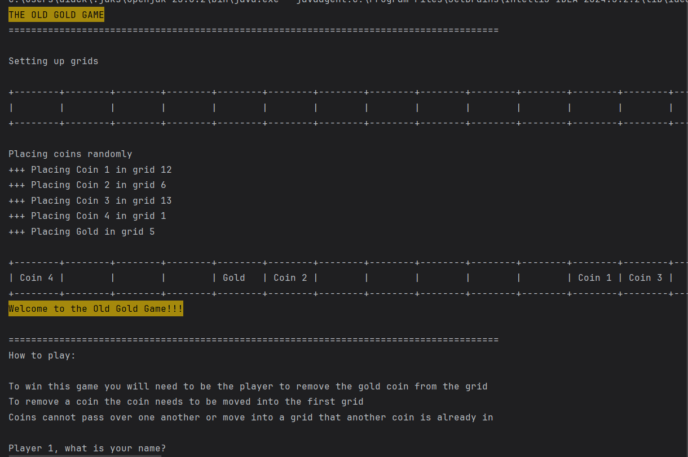

---

## Player names and taking turns

I need to make sure that for this game to be functional, the players can enter their names and when it is their turn it will be displayed on screen.
I also need to make sure that the game correctly knows which players turn it is so that if an invalid move is done that player will not skip their turn

### Test Data To Use
I will test once entering player names and that they are displayed when it is their turn, the players will not be able to leave their name blank.
I will test entering invalid data such as moving the coin out of the grid, having the coins on the same grid or pass over another, or not choosing a coin, to make sure that the players can not skip their turn and move onto the next.

### Expected Test Result

I expect the player names to be displayed when it is their turn, and that it will not be entered blank.
I expect that the game will correctly select which player is to move when invalid data is used on a players turn so that players cannot skip their turn.

---

I attempted to enter nothing and spaces for the users names, I then tried entering invalid data, such as moving a coin out of the grid, moving a coin into another coin, not choosing any coin to move, choosing an invalid number of spaces to move.
The names had worked as expected so that the user could not leave their name blank and could use numbers in their name. When the user was to not choose a coin to move or made an invalid number of spaces to move a coin an error message was played, and they would go again, however, if they were to make a coin move out of the grid or pass over another coin or move into the grid of another coin the error message would play for them to go again, and their turn would be skipped

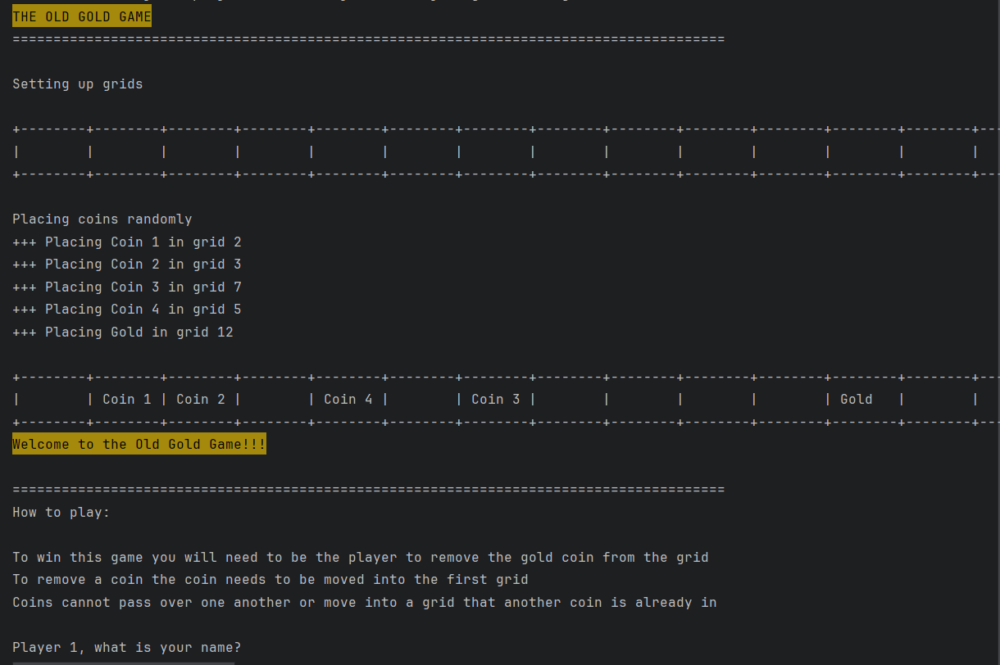

---
I discovered that the players turn was being skipped for an invalid move while still having the error message played all occured in the moveCoin function, this is because the code returned to the main function after the users turn was made.
I solved this issue by changing the moveCoin function into a boolean so that for the users turn to end they would have to enter a valid move which would return true, otherwise it would retrun false and they would have to go again.

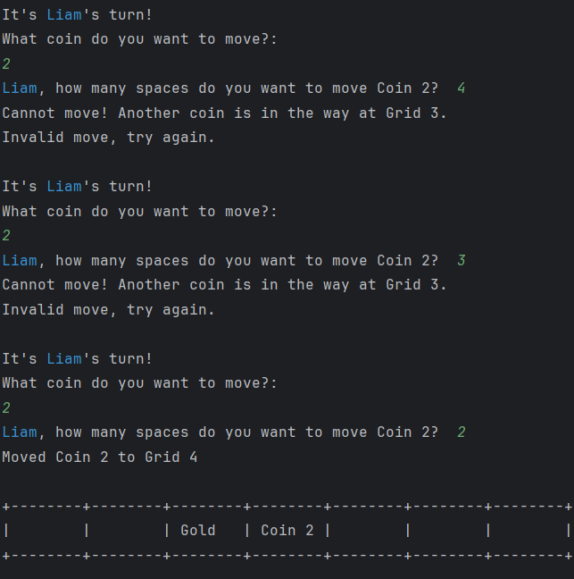

As seen in the above image the players turn was no longer skipped when they were to make the coins pass over another or move into the grid of another.

---

## Winning the game

When the user is to remove the gold coin, the game will end and the player to remove the coin will be declared the winner.
If a user was to quit no winner is declared.

### Test Data To Use

I will do two different tests, one where player 1 is to remove the gold coin, and one where the 2nd player is to remove the coin.
The user to remove the coin will then be declared the winner and the game will stop. I will also do another 2 tests where each player is to quit the game and see whether the game will still declare a winner.

### Expected Test Result

I expect that when player 1 is to remove the coin, they will be declared the winner and the game will end.
I expect that when player 2 is to remove the coin, they will be declared the winner and the game will end.
I expect the game to stop and the code to stop running when any player is to quit the game.
---

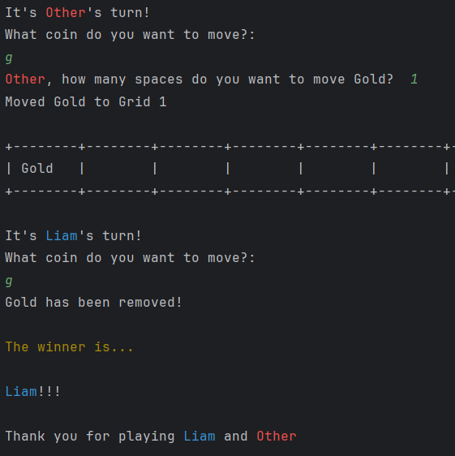

---

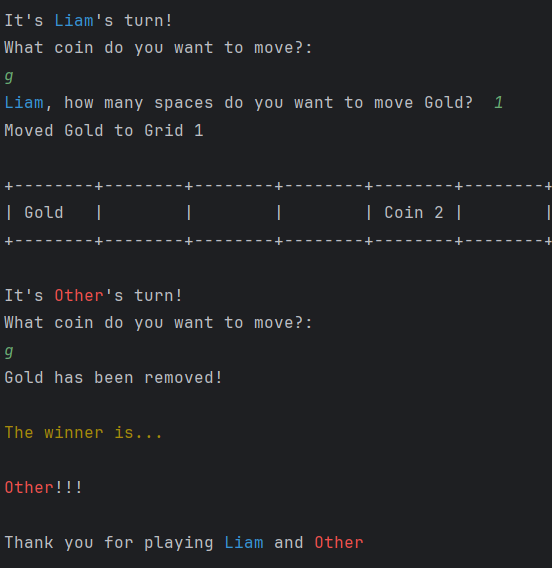

As expected, when player 1 was to remove the gold coin, they were declared the winner, and when player 2 was to remove the gold coin, they were declared the winner.
However, if a user was to enter the quit option (Q) then they were declared the winner.

---

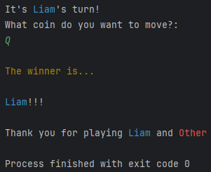

---

I solved this issue by making it so that instead of Q making the code break from the main loop, it instead exited the whole process, now no winner can be declared and the Q button serves its purpose.

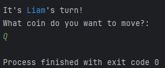

I tested doing this with each player at the first move and a few moves in and the game always was stopped without a winner, the code is now working how I had expected it to.

---

